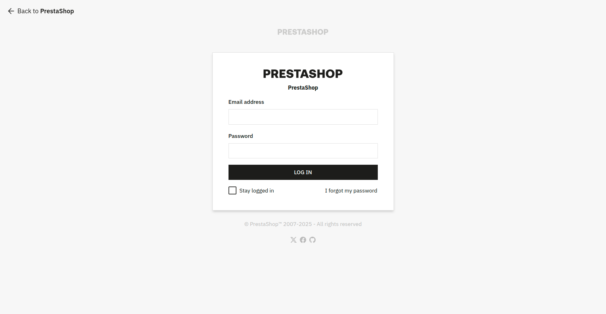
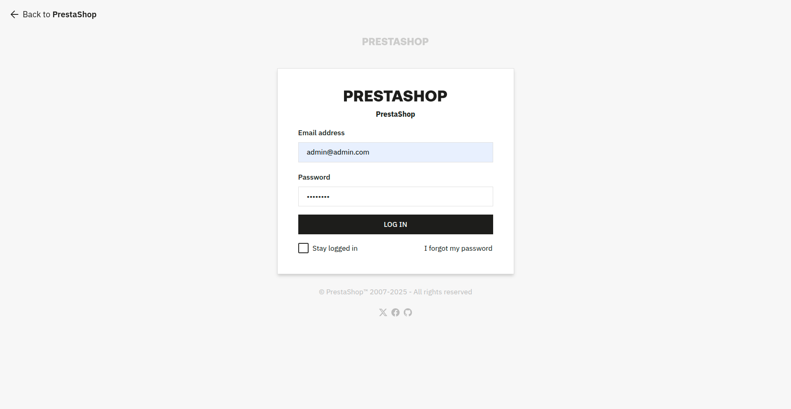
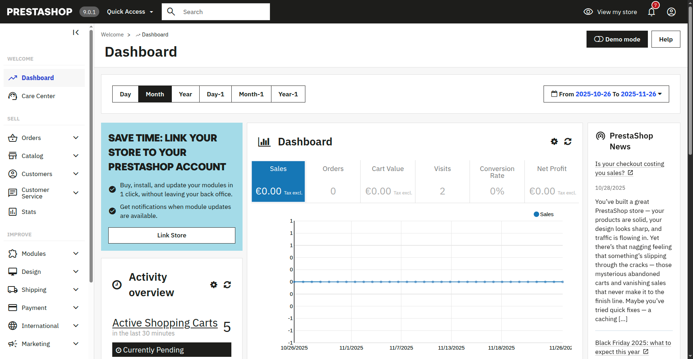
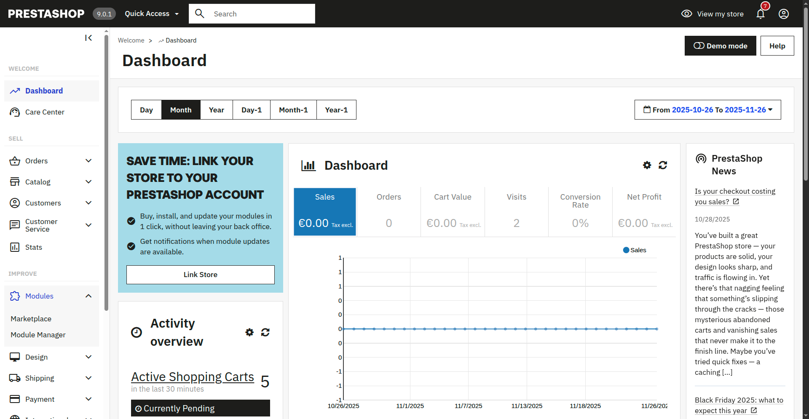
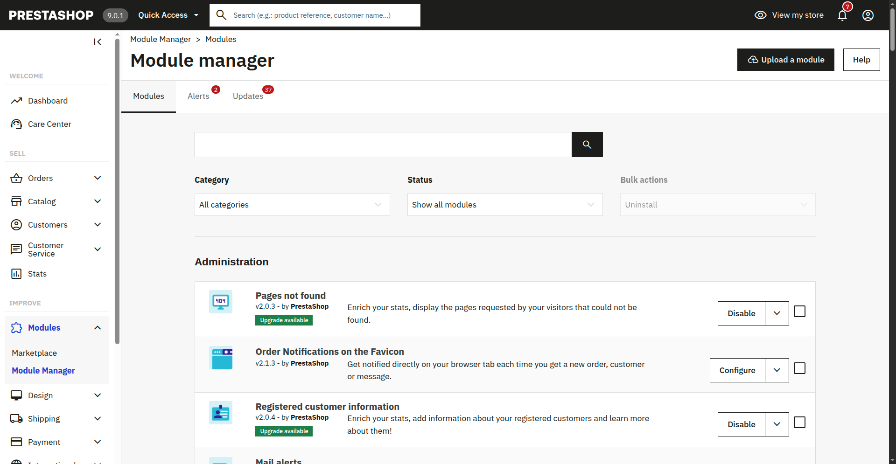
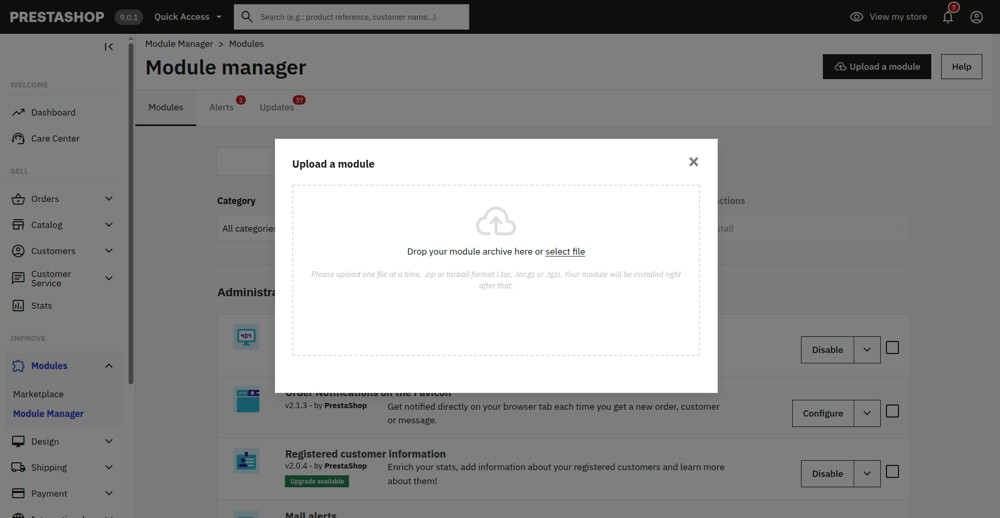
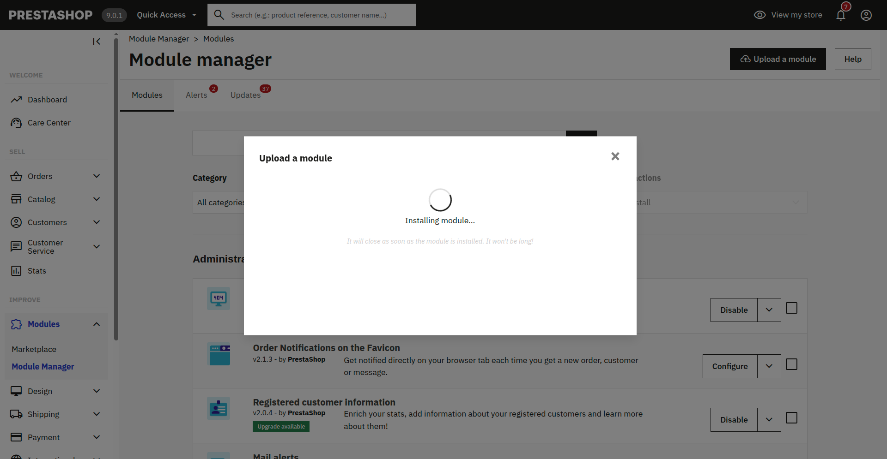
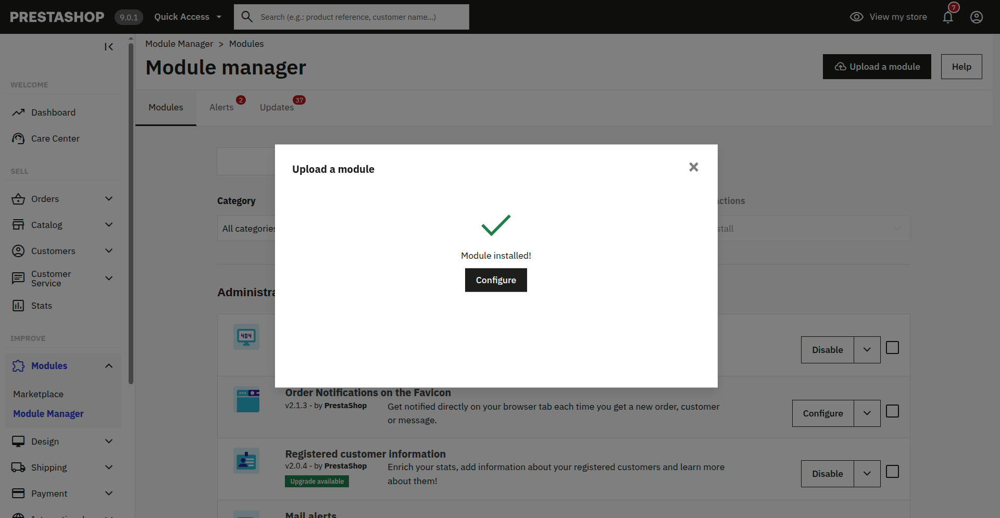
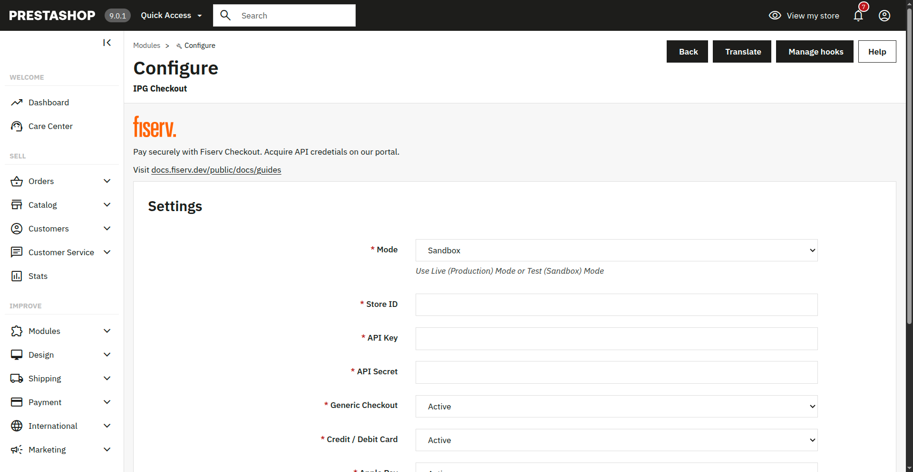
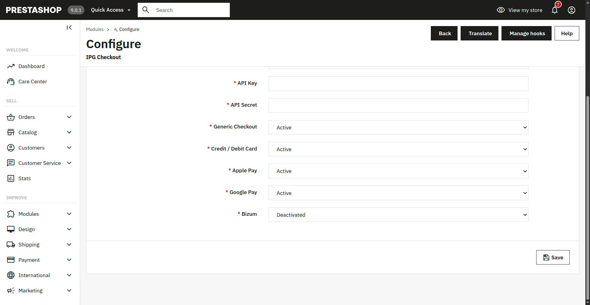

# PrestaShop Dev-Environment

## Basic commands

```docker compose up -d``` or ```npm run up``` to start environment.

 ```docker compose exec prestashop rm -R /var/www/html/install``` or ```npm run rm:install``` to remove install folder (needed from version 9.0.1 of Prestashop)

```docker compose logs -f``` or ```npm run logs``` to float console output of docker environment.

```docker compose down``` or ```npm run down``` to stop environment.

```npm run clean``` delete environment (may need ```sudo``` - depending on Docker configuration)

```npm run test``` will run Cypress (E2E) tests. Make shure prestashop is available on [http://localhost:8080](http://localhost:8080)

## URLs

Frontend: [http://localhost:8080](http://localhost:8080)

Backend: [http://localhost:8080/admin_xxx](http://localhost:8080/admin_xxx)

## Credentials and configuration

| Field     | Value           |
| :-------- | --------------: |
| Username  | admin@admin.com |
| Password  | admin123        |

## .env

If ```.env``` is present the values of ```PS_COUNTRY``` and ```PS_LANGUAGE``` can be overwirtten. This causes prestashop to pull a different country and language during installation.

An example if ```.env``` is provided as ```default.env```. ```.env``` is placed in ```.gitignore```.

| Field       | Default value |
| :---------- | ------------: |
| PS_COUNTRY  | fr            |
| PS_LANGUAGE | en            |

## Install with zip file

1. Login into Backend 
   1. Go to login page (your provider or admin has provided)
   
   2. Fill in your credentials (your provider or admin has provided) then press ```Log In``` Button
   
2. On left side menu go to ```Improve``` &rarr; ```Modules``` &rarr; ```Module Manager```
   1. Look for ```Improve``` on the left side
   
   2. Click ```Modules```
   
   3. Click ```Module Manager```
   
3. On top-right click ```Upload a module``` and select the zip-file.
   1. On top-right click ```Upload a module```
   
   2. Drop or select the zip-file
   
   
4. After installing process finished click ```Configure```.


5. Fill in your configuration you want to use. The press the ```Save``` Button on bottom-right
6. Confirm you configured IPG Checkout under ```Improve``` &rarr; ```Payment``` &rarr; ```Preferences``` the way you want to use it. (Easiest configuration &rarr; Checking ```IPG Transaction``` for ```France``` will make it avaiable for orders in ```France```)
   1. Click ```Payment``` on left side
   