# PrestaShop Dev-Environment

## 1 Requirements

***Will not run without:***

 * Docker - Version ^29.2.0

## 2 Recommended

*Without these dependencies you've got to run provided docker commands*

 * Node - Version ^22.19.0
 * NPM - Version ^11.6.2

## 3 Setup development environment

### 3.1 Quickstart

 1. **Run** ```npm install```
 2. **Run** ```npm run composer:update```
 3. ***Optioal*** ```npm env:setup``` *(make changes to ```.env``` file if needed)*
 4. **Run** ```npm run up```
 5. **Run** ```npm run logs``` and wait for webserver to be running (message in console)
 6. **Run** ```npm run rm:install```
 7. Development environment is now running. You can access [Frontend](http://localhost:8080) or [Backend](http://localhost:8080/admin_xxx)

### 3.2 Quickstart - Build Zip

 1. **Run** ```npm install```
 2. **Run** ```npm run composer:install```
 3. ***Optioal*** ```npm env:setup``` *(make changes to ```.env``` file if needed)*
 4. Zip folder ```ipgcheckout``` to ```ipgcheckout.zip``` (for example with ```npm run zip``` on Linux)

## 3.3 Basic commands

| NPM command | docker command | Description |
| :--------- | -------------- | ----------: |
| ```npm run up``` | ```docker compose -f docker-compose.dev.yml -f docker-compose.yml up -d``` | Starts containers persiting data to /data folder. **Development is mounted directly into this container**. Used for development. |
| ```npm run up:test``` | ```docker compose up -d``` | Runs containers **without** persitance (no data are put to disk). Used to e2e testing. **Development is not mounted to environment** |
| ```npm run logs``` | ```docker compose logs -f prestashop``` | Logs output of prestashop container to console. |
| ```npm run rm:install``` | ```docker compose exec prestashop rm -R /var/www/html/install``` | Removed install folder. Needed to enter backend since Prestashop 9.0.2. Execte after setup. |
| ```npm run down``` | ```docker compose down``` | Stops and removes containers. **If you're using ```npm run up:test``` all data will be lost.**  |
| ```npm run clean``` | ***Not available*** | Removes ```/data``` and ```/ipgcheckout/vendor``` causing data loss. An resetting plattform. May need ```sudo``` |
| ```npm run test``` | ***Not available*** | Runs e2e tests. Needs untouched ```npm run up:test``` to be running|
| ```npm run cypress:open``` | ***Not available*** | Runs e2e testing tool (Cypress). Needs untouched ```npm run up:test``` to be running|
| ```npm run zip``` | ***Not available*** | Creates ipgcheckout.zip for production usage **(ONLY on Linux)**|

## 3.4 URLs

Frontend: [http://localhost:8080](http://localhost:8080)

Backend: [http://localhost:8080/admin_xxx](http://localhost:8080/admin_xxx)

## 3.5 Credentials and configuration

| Field     | Value           |
| :-------- | --------------: |
| Username  | admin@admin.com |
| Password  | admin123        |

## 3.6 .env

If ```.env``` is present the values of ```PS_COUNTRY``` and ```PS_LANGUAGE``` can be overwirtten. This causes prestashop to pull a different country and language during installation.

An example for ```.env``` is provided as ```default.env```. ```.env``` is placed in ```.gitignore```.

| Field        | Default value               | *Other possible values*            |
| :----------- | --------------------------- | ---------------------------------: |
| PS_COUNTRY   | fr                          | GB, DE, IE, ...                    |
| PS_LANGUAGE  | en                          | de, fr, es, ...                    |
| PRESTA_IMG   | prestashop/prestashop:9.0.2 | ***Other available Docker Image*** |
| MYSQL_IMG    | mysql:5.7                   | ***Other available Docker Image*** |
| COMPOSER_IMG | composer:2.9.5              | ***Other available Docker Image*** |

## 3.7 Additional documentation

[Architecture](documentation/architecture/README.md)

[Checkout](documentation/checkout/README.md)

[Credetials checking](documentation/credentials/README.md)

[Refund](documentation/refund/README.md)

## 2 Install with zip file

1. Login into Backend 
   1. Go to login page (your provider or admin has provided)
   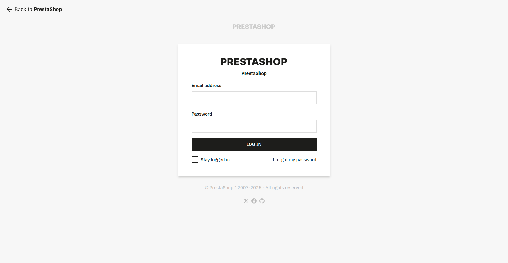
   2. Fill in your credentials (your provider or admin has provided) then press ```Log In``` Button
   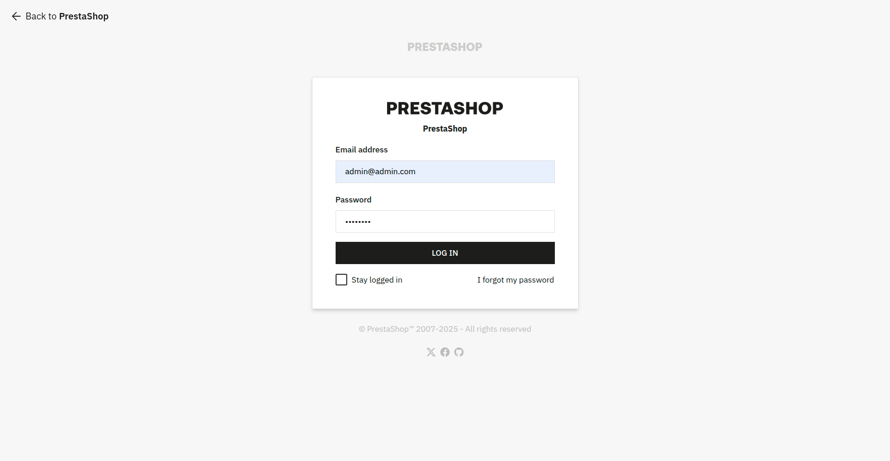
2. On left side menu go to ```Improve``` &rarr; ```Modules``` &rarr; ```Module Manager```
   1. Look for ```Improve``` on the left side
   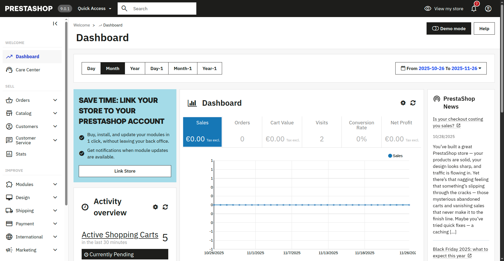
   2. Click ```Modules```
   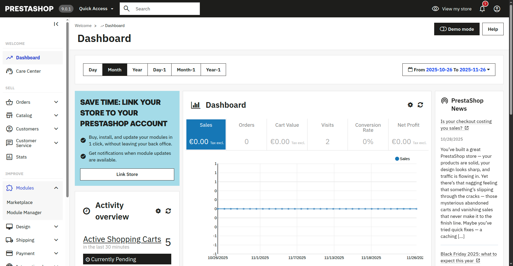
   3. Click ```Module Manager```
   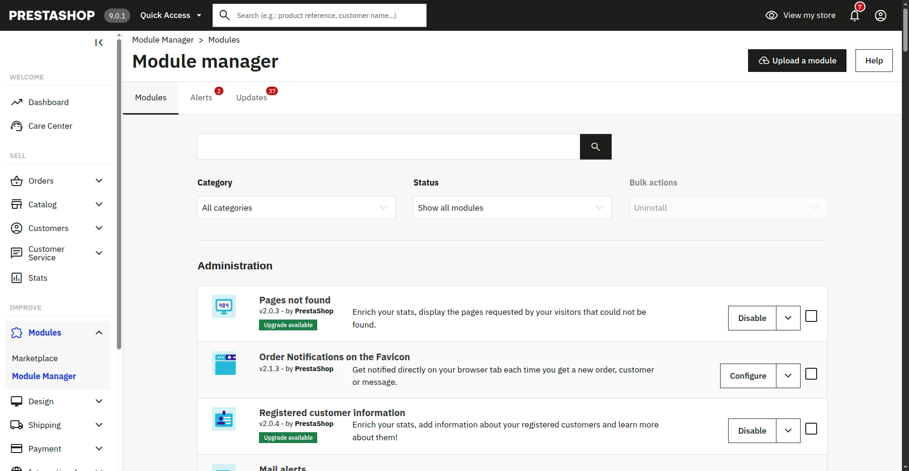
3. On top-right click ```Upload a module``` and select the zip-file.
   1. On top-right click ```Upload a module```
   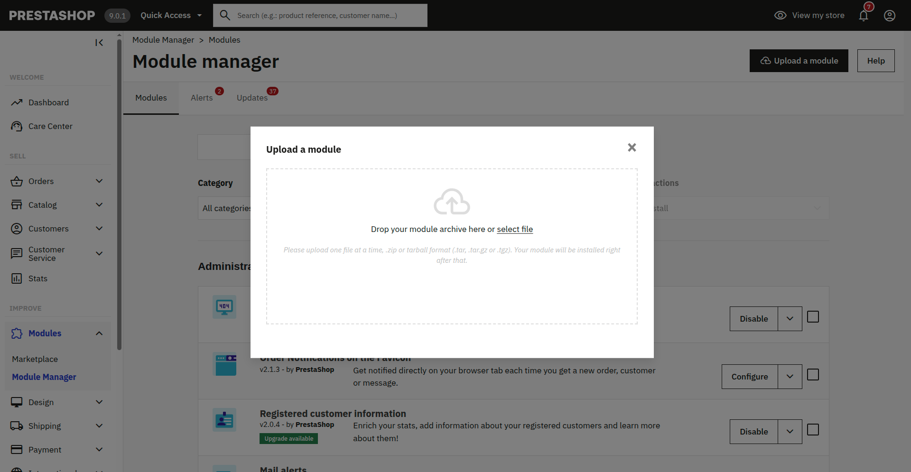
   2. Drop or select the zip-file
   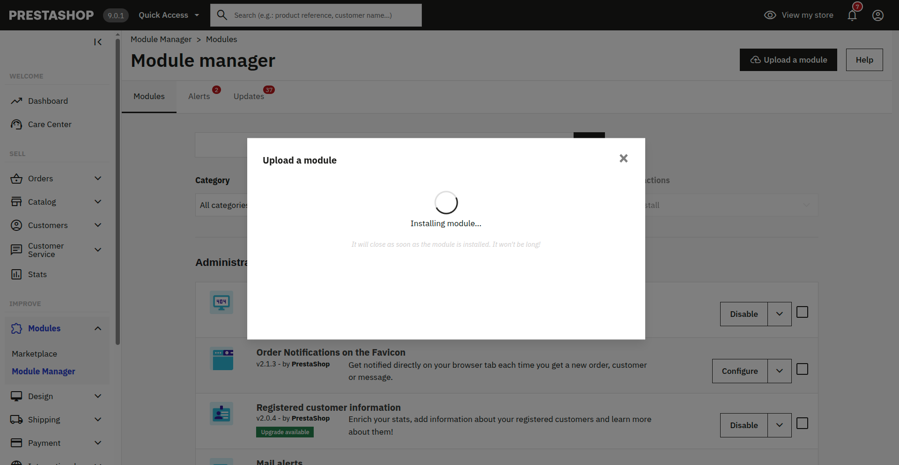
   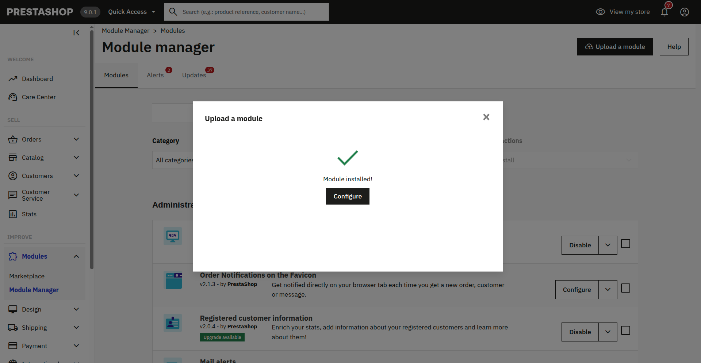
4. After installing process finished click ```Configure```.
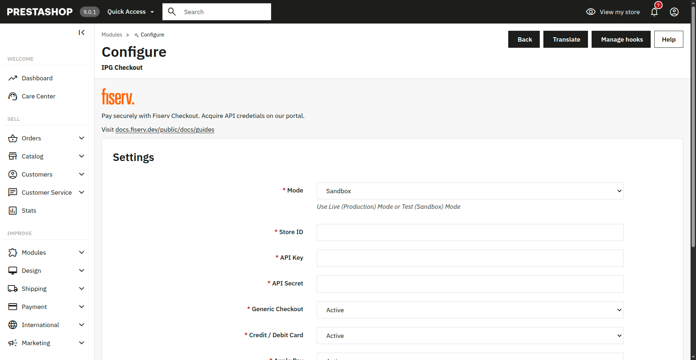
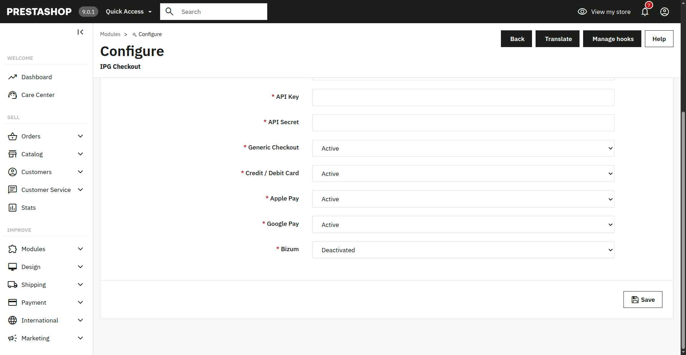
5. Fill in your configuration you want to use. The press the ```Save``` Button on bottom-right
6. Confirm you configured IPG Checkout under ```Improve``` &rarr; ```Payment``` &rarr; ```Preferences``` the way you want to use it. (Easiest configuration &rarr; Checking ```IPG Transaction``` for ```France``` will make it avaiable for orders in ```France```)
   1. Click ```Payment``` on left side
   ![Dashboard Payment opened(./documentation/assets/11-Dashboard-Payment-open.png)
   2. Click ```Preferences``` and check configuration
   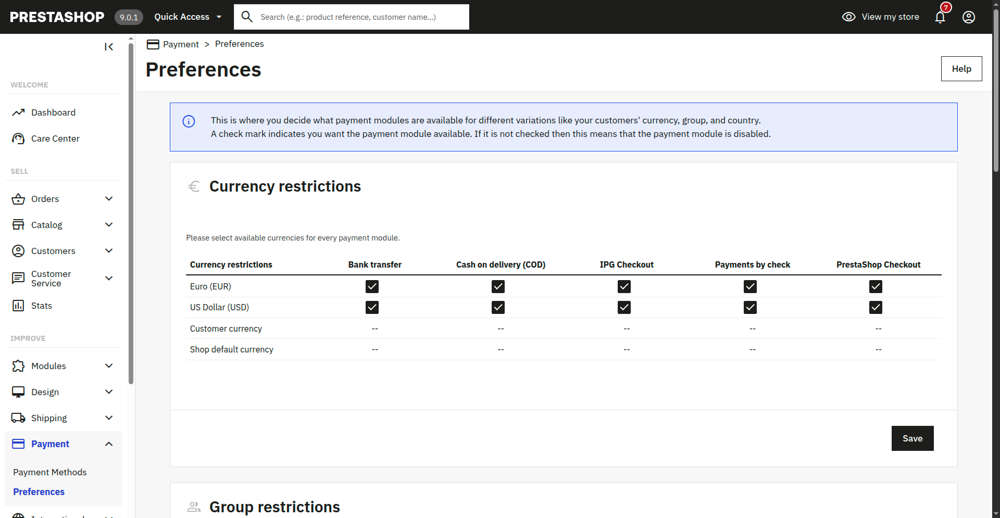
   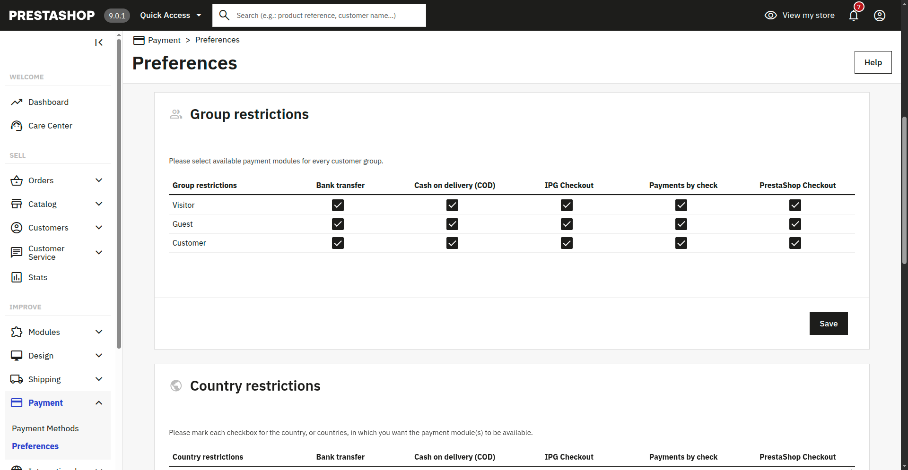
   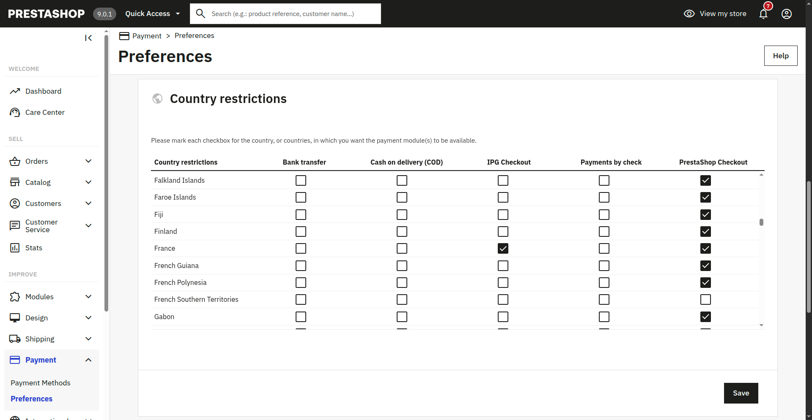
   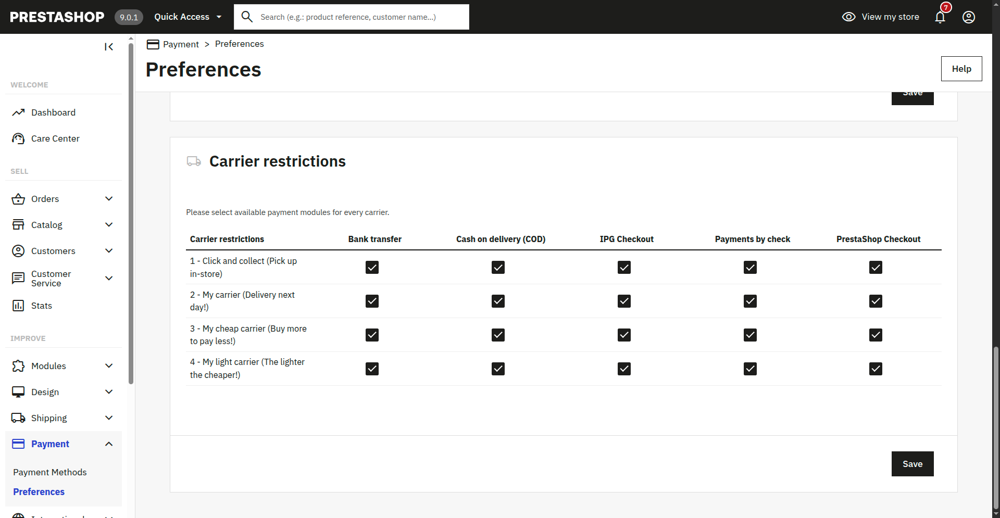
7. __Done__