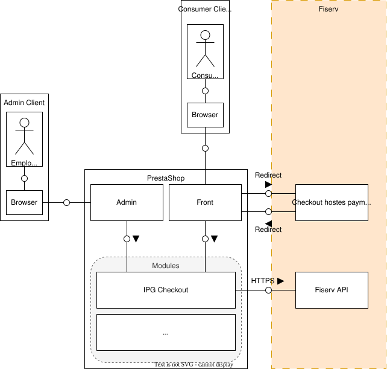

# Architecture



## Desciption

The IPGCheckout module is installed into a Prestashop instance. Depending on Prestashop hook ```Admin``` and ```Front``` trigger IPG Checkout.

```Frontend``` is using Checkout Pages and redirects. ```Admin``` is able to call APIs but will trigger no redirects to targets outside of the current Prestashop instance.