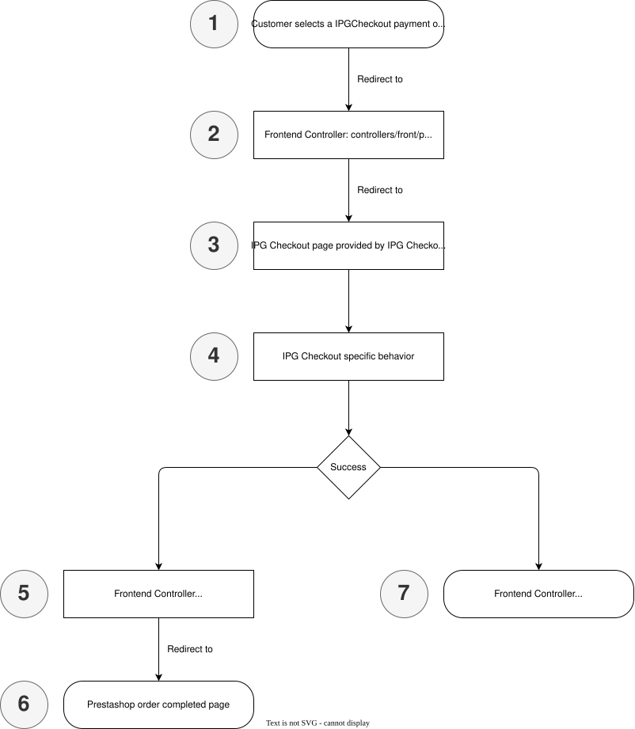
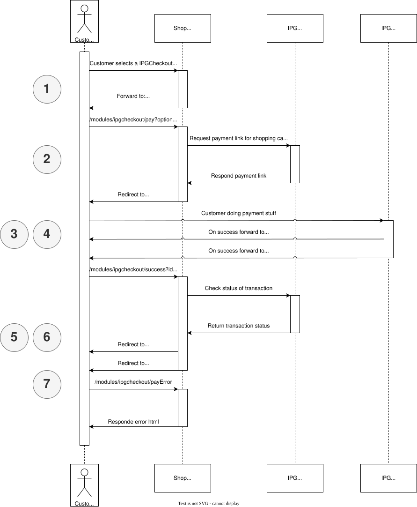

# Checkout




## 1 Customer selects a IPGCheckout payment option

Customer selecting an IPGCheckout payment methode for payment.

## 2 Frontend Controller: controllers/front/pay.php

Customer is forwarded to ```/modules/ipgcheckout/pay?option={option}``` where ```option``` is limited to ```applepay```, ```googlepay```, ```cards```, ```bizum``` and ```generic```. Any other ```option``` will be interperted as ```generic```.

[IPG Checkout service documentation](https://docs.fiserv.dev/public/reference/postcheckouts) is used to create payment link.

Customer is forwarded to payment link automatically.

TBD: Request example

## 3 IPG Checkout page provided by IPG Checkout in response

__Out of IPGCheckout scope__

Customer is doing his stuff on payment page.

## 4 IPG Checkout specific behavior

__Out of IPGCheckout scope__

IPG is doing some magic.

## 5 Frontend Controller: controllers/front/success.php

On Success IPG is redirecting to this controller. The controller checks with (Checkout Solution)[https://docs.fiserv.dev/public/reference/get-checkouts-id] if payment was completed. If webhook was called before by IPG it's checking anyway.

## 6 Prestashop order completed page

Customer is redirected to ```order completed``` page.

__END__

### 7 Frontend Controller: controllers/front/payError.php

On error IPG is redirecting to this controller. Problems are prompted to Prestashop logs and the customer gets a message than an error occured