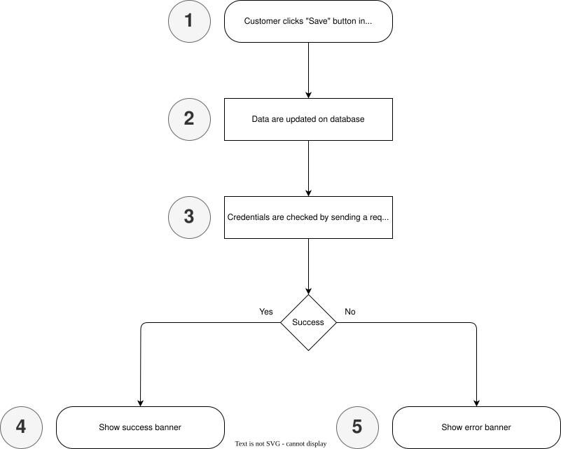
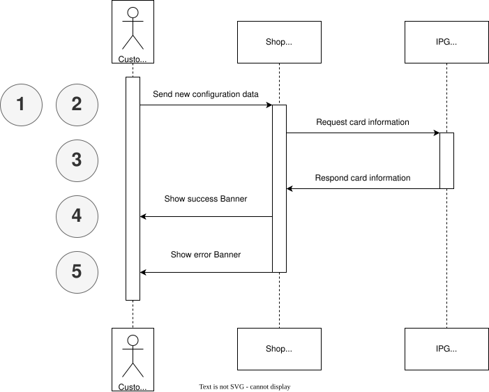

# Credentials checking

When the ```SAVE``` button is clied Credentials (**ONLY** API Key and API Secret) are checked. If credentials are fine user will be informed by a banner. If there is anything wrong with the credentials an error banner will be visible.


## Flows




### 1 Customer clicks "Save" button in module configuration

### 2 Data are updated on database

The updated informations a saved via [Configuration storage service](https://devdocs.prestashop-project.org/1.7/development/components/configuration/#check-if-a-configuration-data-set-exists). So even if updated values are wrong changes will be perstitant.

### 3 Credentials are checked by sending a request to card information API

A request for a wrong card information is send to [Card Information Lookup API](https://docs.fiserv.dev/public/reference/cardinfolookup) to check if a response is generated or if the response includes wrong credentials.

### 4 Show success banner

If response includes no 403 or other wrong credentials informaions a success banner is shown.

### 5 Show error banner

If response includes 403 or other wrong credentials informaions an error banner is shown.