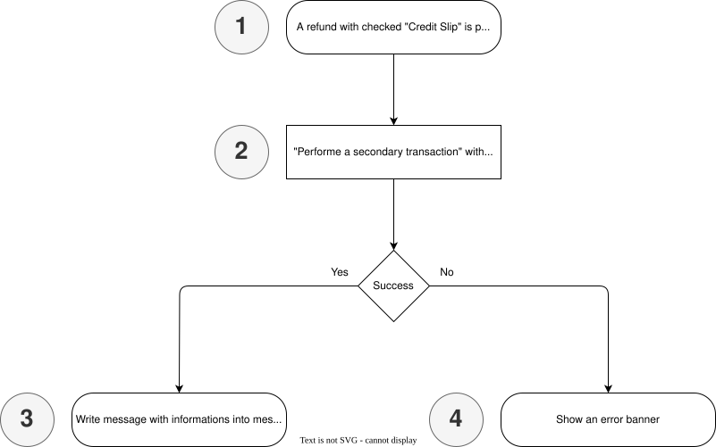
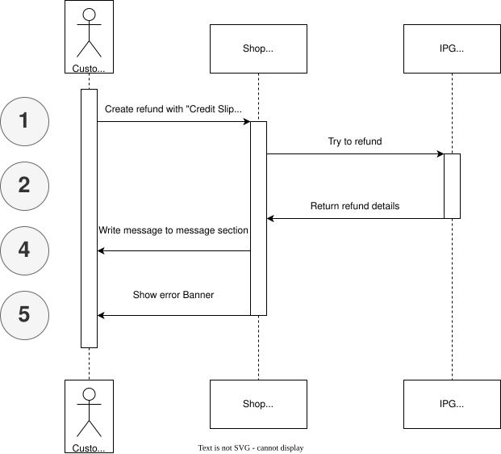

# Refund

A refund is triggered if a refund with check ```Credit slip``` is executed. If there are no error as message with the data of the credit slip is added to the messages. Otherwise an error banner is showing up.

## Flows




### 1 Customer clicks "Save" button in module configuration

### 2 "Performe a secondary transaction" with matching data is called

Try to performe a refund with [Perform a secondary transaction](https://docs.fiserv.dev/public/reference/submitsecondarytransaction).


### 3 Write message with informations into message section

If refund went well a message is written to message section

### 4 Show an error banner

If response includes 403 or other wrong credentials informaions an error banner is shown.